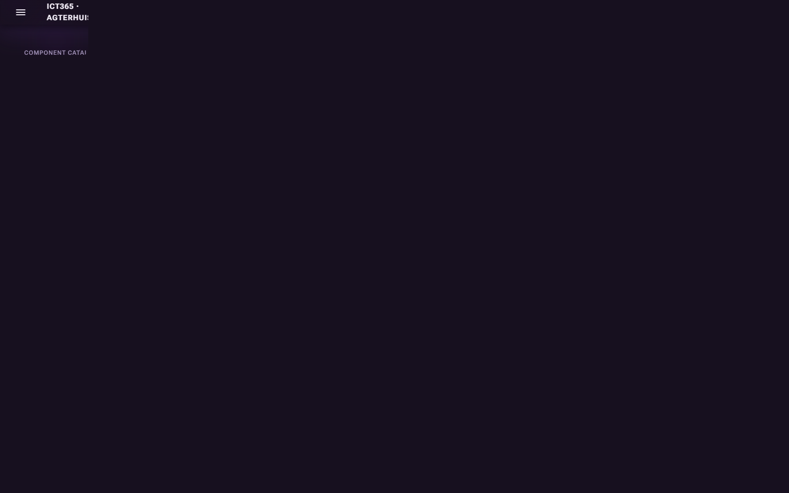
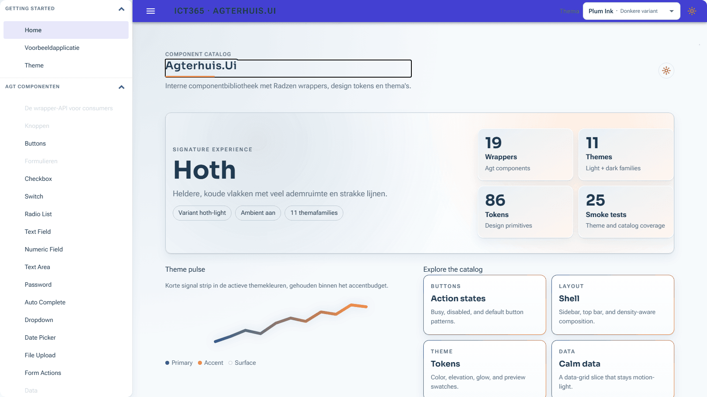
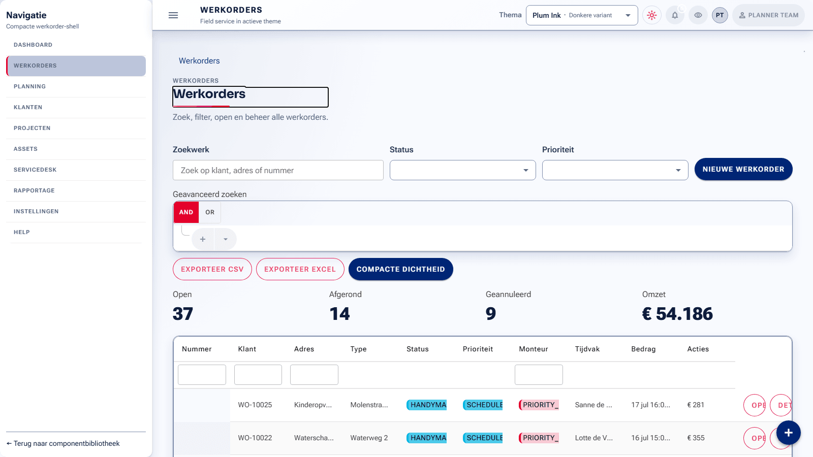
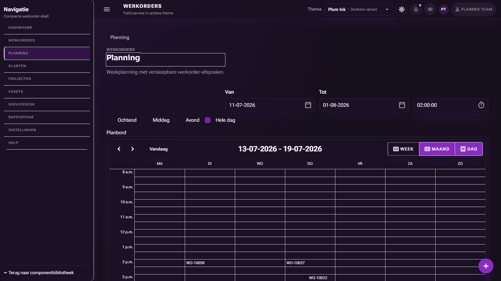

# Agterhuis.Ui

Multi-theme Blazor design system built on Radzen: 11 theme families (including Star Wars-inspired themes), WCAG 2.2 AA guardrails, 161 themed standalone surfaces, and full themed coverage across 420 installed Radzen components.

[](https://github.com/RobertAgterhuis/Blazor.Radzen.Themes/actions/workflows/ci.yml)
[](LICENSE)
[](https://dotnet.microsoft.com/)
[](https://www.nuget.org/packages/Radzen.Blazor)

If the CI badge is gray on a new fork, it turns green after the first successful main-branch run.

## Screenshot Strip


_Home showcase in plum-dark. Hero and metrics are rendered after deterministic settle waits._


_Home showcase in hoth-light with the same captured viewport for visual comparison._


_Werkorders dashboard in autotaalglas-light with real data grid content visible._


_Planning scheduler in plum-dark with active weekly board and appointments._

See [docs/GALLERY.md](docs/GALLERY.md) for the full screenshot set, including per-family captures and workflow pages.

## Quickstart

### 1) Install package

```bash
dotnet add package Agterhuis.Ui
```

### 2) Register services

```csharp
builder.Services.AddAgterhuisUi();
```

### 3) Add CSS and JS in host page (order matters)

1. `_content/Radzen.Blazor/css/material-base.css`
2. `_content/Agterhuis.Ui/css/agt-theme.css`
3. `_content/Agterhuis.Ui/css/agt-utilities.css`
4. `app.css`
5. Anti-FOUC inline script that restores `agt-ui-theme` to `html[data-agt-theme]`
6. `_content/Radzen.Blazor/Radzen.Blazor.min.js`
7. `_content/Agterhuis.Ui/theme-interop.js`

For the full host-page snippet, see [docs/CONSUMING.md](docs/CONSUMING.md).

## Theme Gallery

Default variant: `plum-dark`

| Family | Palette Chips | Character | Default Variant |
| --- | --- | --- | --- |
| `plum` | `#680898` `#f1ce05` | Deep plum + gold accent | `plum-dark` |
| `ocean` | `#0b6e6e` `#e8a13d` | Teal/blue calm surfaces | `ocean-dark` |
| `dagobah` | `#4f7338` `#7cfc5a` | Organic greens with bright accent | `dagobah-dark` |
| `dathomir` | `#a8211c` `#ff3b30` | Crimson-forward dark contrast | `dathomir-dark` |
| `hoth` | `#35678f` `#ff8c42` | Cool blue slate with orange accent | `hoth-dark` |
| `tatooine` | `#b0761d` `#e8622c` | Sand, amber, and desert orange | `tatooine-dark` |
| `imperial` | `#1c2026` `#f43f5e` | High-contrast neutral command look | `imperial-dark` |
| `ms365` | `#0f6cbd` `#ebf3fc` | Fluent 2 admin-center blue with card-first canvas | `ms365-light` |
| `autotaalglas` | `#123f71` `#df2e38` | Corporate brand baseline | `autotaalglas-light` |
| `autotaalglas-contrast` | `#0d2f57` `#df2e38` | Accessibility-first variant | `autotaalglas-contrast-light` |
| `autotaalglas-portal` | `#1d6ea4` `#00b5e2` | Customer journey emphasis | `autotaalglas-portal-light` |
| `autotaalglas-mono` | `#3b4f63` `#6f859b` | Monochrome business reporting | `autotaalglas-mono-light` |

## Architecture in One Paragraph

Theme colors live only inside `html[data-agt-theme="..."]` scopes, while `:root` keeps structural tokens (spacing, radius, motion, z-index). Radzen `--rz-*` variables are mapped to Agterhuis `--agt-*` tokens through shared partials, and wrappers consume those tokens without hard-coded colors. Guardrail tests enforce token parity across all theme families and block token bleed outside theme scopes.

## Documentation

- [Documentation index](docs/README.md)
- [Theming guide](docs/THEMING.md)
- [Consumer integration](docs/CONSUMING.md)
- [Accessibility statement](docs/ACCESSIBILITY.md)
- [Contrast matrix](docs/A11Y-CONTRAST.md)
- [Theme coverage](docs/THEME-COVERAGE.md)

## Run the Demo

### Live demo

[](https://<your-swa-name>.azurestaticapps.net/)

The public demo is intended to run from Azure Static Web Apps. The local sample still runs with `dotnet run`.

```bash
dotnet run --project samples/Agterhuis.Ui.Demo
```

## Starter Template

Create a new app scaffold with the packaged template:

```bash
dotnet new agterhuis-app -n MijnApp --theme plum --variant dark
```

The template package lives under [templates/Agterhuis.Ui.Templates](templates/Agterhuis.Ui.Templates) and is designed to be packed with the library release. See [docs/CONSUMING.md](docs/CONSUMING.md) for the host integration order.

## Designer

The LowCode designer lives in the demo app at `/designer`. It supports template-based starting points, browser file open/save for `.agtdesign` documents, local draft recovery, export, and a command palette.

Designer notes and phase summaries live under [docs/designer](docs/designer), with the model and export history in [docs/designer/MODEL.md](docs/designer/MODEL.md) and [docs/designer/PHASE_4_CODEGEN_EXPORT.md](docs/designer/PHASE_4_CODEGEN_EXPORT.md).

## Build and Test

```bash
dotnet restore --locked-mode
dotnet build Agterhuis.Ui.sln -c Release
dotnet test Agterhuis.Ui.sln -c Release
```

## Smart Contrast Sweep

The full contrast sweep is expensive. Use batched runs with checkpoint/resume:

```bash
# full run
npm run contrast:sweep

# resume interrupted run from checkpoint
npm run contrast:sweep:resume

# fast sample run (2 themes, 10 routes)
npm run contrast:sweep:fast

# one controlled batch directly via node
node eng/contrast-sweep/contrast-sweep.mjs --max-themes=1 --max-routes=20 --stop-after=20 --checkpoint-every=2

# shard runs (example: first quarter)
node eng/contrast-sweep/contrast-sweep.mjs --shard=1/4 --checkpoint-every=2

# auto-loop chunked runs until done (default chunk 25)
npm run contrast:sweep:loop

# auto-loop with custom chunk size and scoped filters
npm run contrast:sweep:loop -- --chunk-size=10 --themes=plum,ocean --routes=/,/catalog/buttons
```

Checkpoint file: `eng/contrast-sweep/contrast-sweep.checkpoint.json`

## Visual Regression

Run the baseline comparison against the Playwright-backed capture harness:

```bash
npm run vr:test
npm run vr:approve
```

The baselines and reports live under [eng/visual-regression](eng/visual-regression).
