# Screenshot Gallery

[Docs Index](README.md)

All captures are generated by the deterministic script in eng/screenshots/capture.mjs at 1600x900 with render waits and blank-image guard validation.

## Workflow Captures

### Home - plum-dark

### Home - hoth-light

### Catalog Buttons - imperial-dark

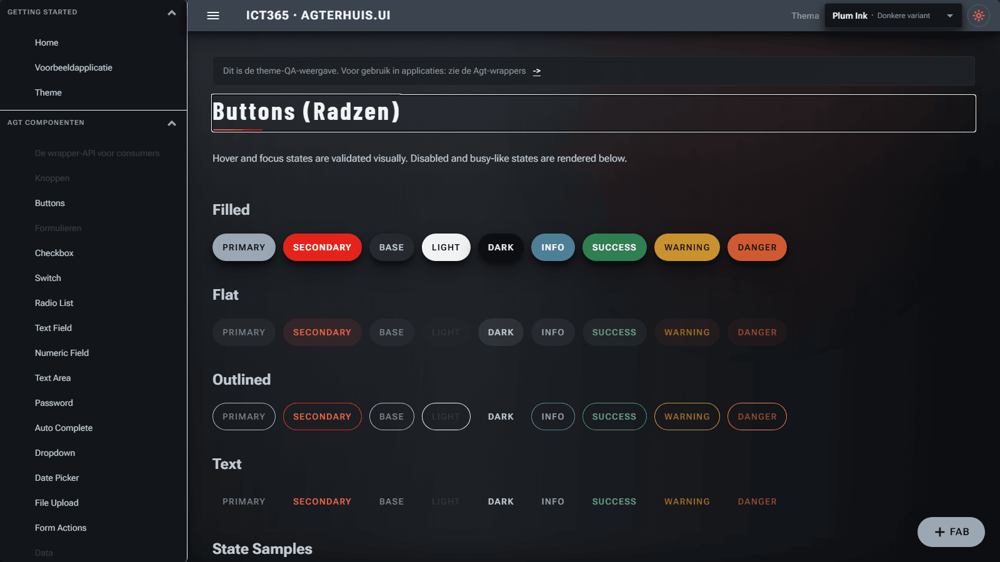

### Werkorders Dashboard - autotaalglas-light

### Werkorders Grid with Detail Dialog

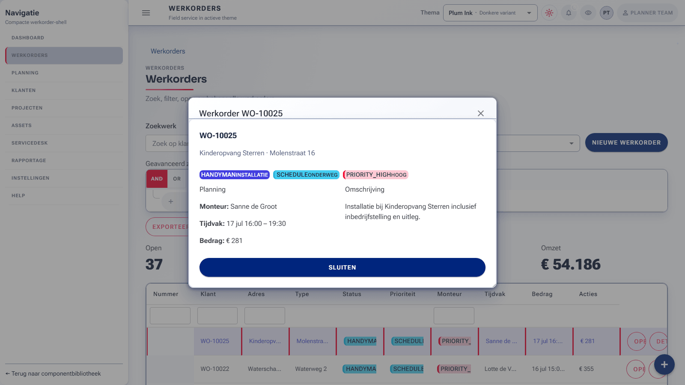

### Planning Scheduler - plum-dark

## Theme Family Gallery

| Family | Variant | Screenshot |
| --- | --- | --- |
| plum | plum-dark | 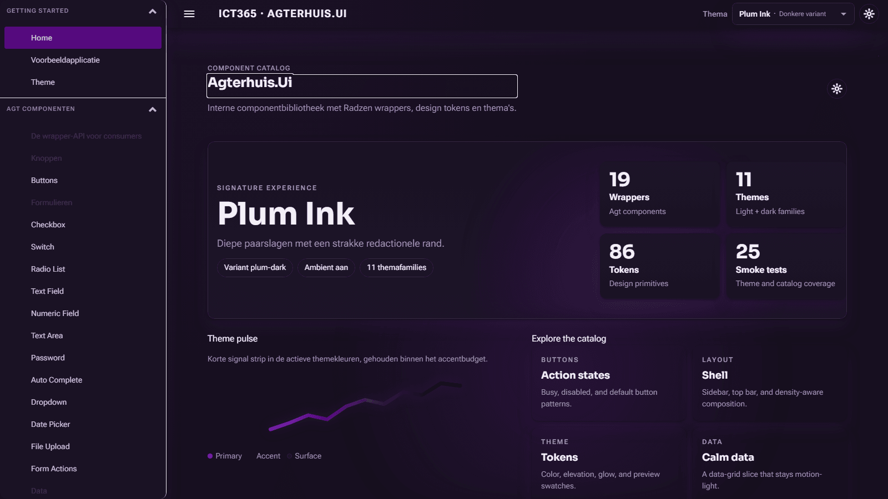 |
| ocean | ocean-dark | 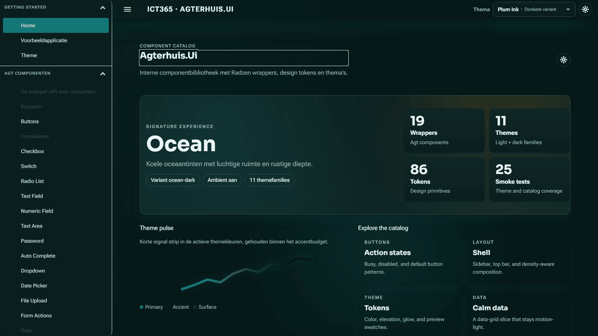 |
| dagobah | dagobah-dark | 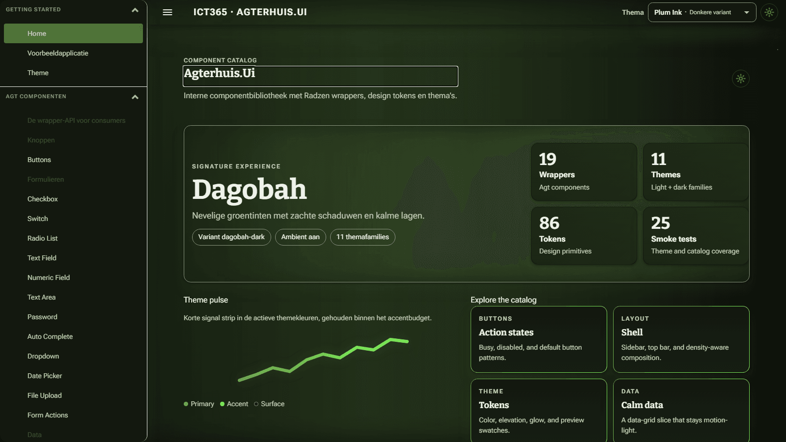 |
| dathomir | dathomir-dark | 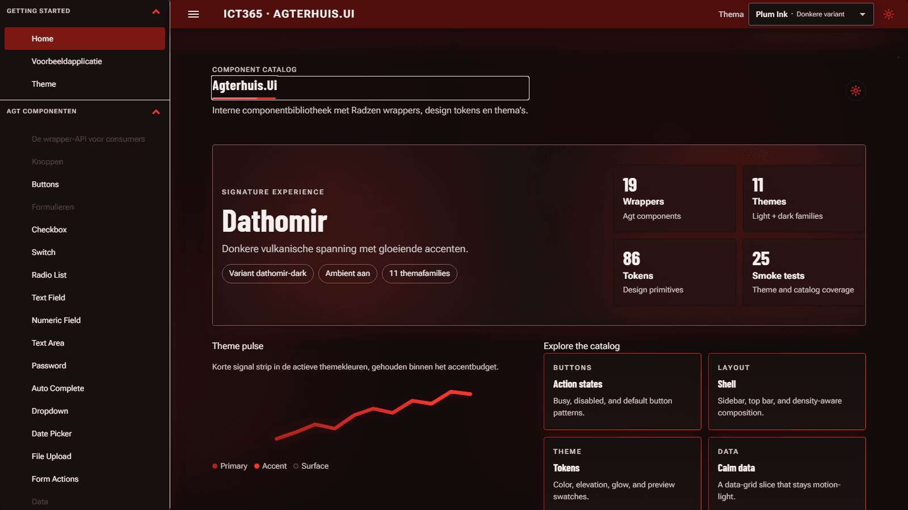 |
| hoth | hoth-dark | 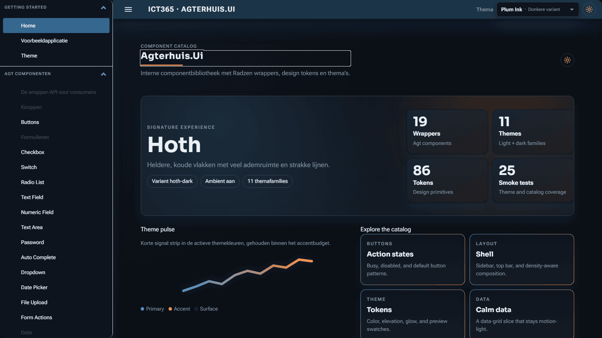 |
| tatooine | tatooine-dark | 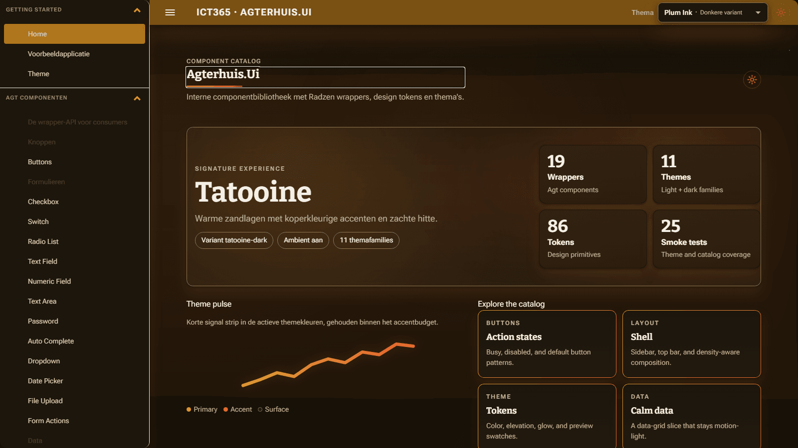 |
| imperial | imperial-dark | 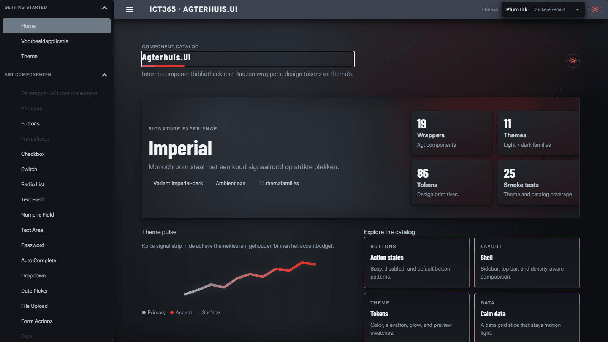 |
| autotaalglas | autotaalglas-light | 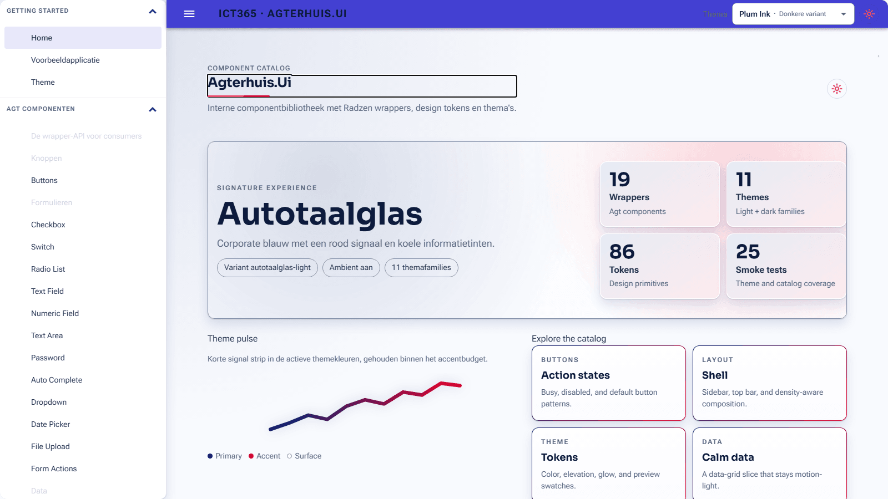 |
| autotaalglas-contrast | autotaalglas-contrast-light | 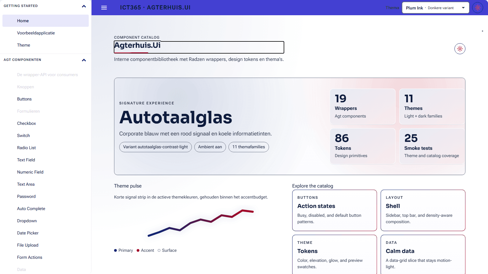 |
| autotaalglas-portal | autotaalglas-portal-light | 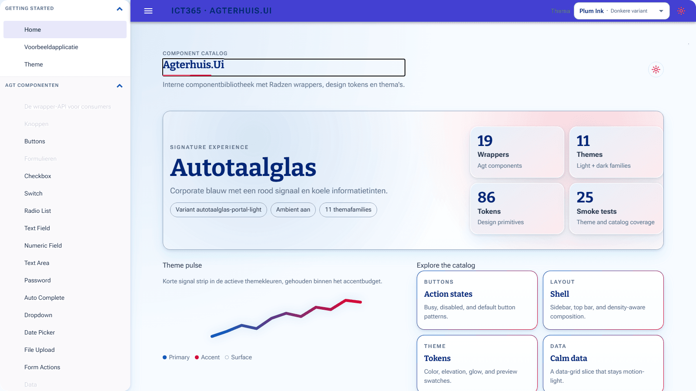 |
| autotaalglas-mono | autotaalglas-mono-light | 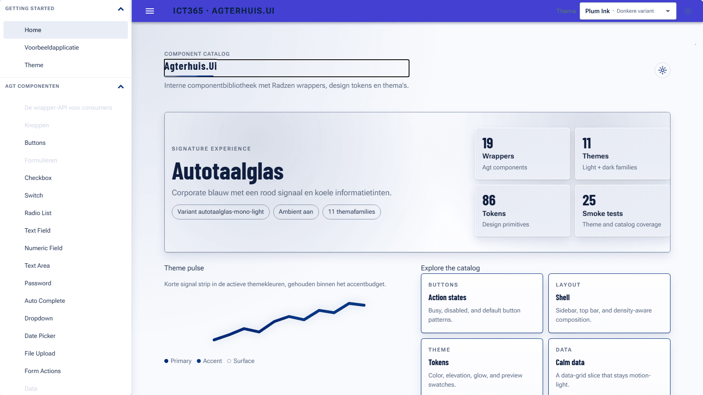 |
