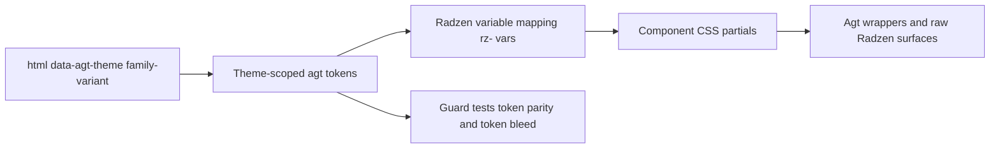

# Theming Guide

[Docs Index](README.md)

Agterhuis.Ui components only consume `--agt-*` design tokens. To add a custom theme, create a token override file; component CSS stays unchanged.

## Built-in theme families

- `plum`: `plum-light`, `plum-dark`
- `ocean`: `ocean-light`, `ocean-dark`
- `dagobah`: `dagobah-light`, `dagobah-dark`
- `dathomir`: `dathomir-light`, `dathomir-dark`
- `hoth`: `hoth-light`, `hoth-dark`
- `tatooine`: `tatooine-light`, `tatooine-dark`
- `imperial`: `imperial-light`, `imperial-dark`
- `azure`: `azure-light`, `azure-dark`
- `ms365`: `ms365-light`, `ms365-dark`
- `volt`: `volt-light`, `volt-dark`
- `autotaalglas`: `autotaalglas-light`, `autotaalglas-dark`
- `autotaalglas-contrast`: `autotaalglas-contrast-light`, `autotaalglas-contrast-dark`
- `autotaalglas-portal`: `autotaalglas-portal-light`, `autotaalglas-portal-dark`
- `autotaalglas-mono`: `autotaalglas-mono-light`, `autotaalglas-mono-dark`

Compatibility aliases are supported:

- `data-agt-theme="dark"` maps to `plum-dark`
- `data-agt-theme="light"` or missing attribute maps to `plum-light`

## Architecture flow



## Create your own theme family

1. Copy one built-in theme file from `src/Agterhuis.Ui/wwwroot/css/themes/`.
2. Rename selectors to your family variants, for example `forest-light` and `forest-dark`.
3. Replace token values only. Keep token names identical (`--agt-*`).
4. Include your file after `agt-tokens.css` and before component partials.

Example selector pattern:

```css
html[data-agt-theme="forest-light"] {
  --agt-color-primary-500: #1f7a3a;
  /* ... full token set ... */
}

html[data-agt-theme="forest-dark"] {
  --agt-color-primary-500: #4cae6c;
  /* ... full token set ... */
}
```

## Register in options

```csharp
builder.Services.AddAgterhuisUi(options =>
{
    options.DefaultTheme = "forest-dark";
    options.AvailableThemes =
    [
        AgtTheme.Plum,
        AgtTheme.Ocean,
      AgtTheme.Dagobah,
      AgtTheme.Dathomir,
        AgtTheme.Hoth,
        AgtTheme.Tatooine,
      AgtTheme.Imperial,
        AgtTheme.Azure,
        AgtTheme.Ms365,
      AgtTheme.Volt,
      AgtTheme.Autotaalglas,
      new AgtTheme("forest", "Forest", "forest-light", "forest-dark")
    ];
});
```

## Theme switching and persistence

- Use `AgtThemeSwitcher` for family dropdown + light/dark variant toggle.
- `AgtThemeToggle` remains available for variant flip within the current family.
- Theme preference is stored in `localStorage` key `agt-ui-theme`.
- To avoid FOUC, apply the stored theme in a small inline `<head>` script before Blazor boots.

## Azure notes

- `azure-light` is the hero variant for the family; it keeps the light blade canvas while the header chrome stays dark in both variants.
- This family uses a system Segoe stack only; no Microsoft font files are bundled or redistributed.
- The closest Azure Portal feel is `azure-*` plus compact density, but density stays a separate runtime axis.

## MS365 notes

- `ms365-light` is the hero variant for the family; it uses a white card canvas, Fluent 2 blue chrome, and softer radius/shadow treatment than `azure-*`.
- The family keeps the same no-bundled-font rule as the other Microsoft-inspired themes, relying on the system Segoe stack only.
- `ms365-*` should stay visually distinct from `azure-*`: blue chrome, rounder cards, and a friendlier admin-center composition.

## Volt notes

- The editorial showcase under `/blog` applies `volt-dark` as the first-visit default (`volt-light` for article read mode), then respects user theme changes via the regular switcher.
- Read mode preference is persisted per browser session and only auto-forces the variant when the active family is `volt`.

## Autotaalglas notes

- `autotaalglas-light` is the hero variant for the family; when `autotaalglas` is requested as a family id it resolves to the light variant.
- The warning color in this family is intentionally derived (amber `#e8a13d`-class), because the corporate palette does not contain a dedicated warning hue.

## Brand sub-families

- `autotaalglas`: employee / corporate default. Balanced navy-first brand application with measured red signal use.
- `autotaalglas-contrast`: accessibility-first variant. Higher-contrast borders, double focus rings, no glass, no ambient atmosphere.
- `autotaalglas-portal`: customer journey variant. Brighter interaction blue, cyan-forward highlights, softer radius and shadows.
- `autotaalglas-mono`: reporting-oriented calm palette. Monochrome blue-gray register; red is reserved for danger only.

### prefers-contrast: more

When a consumer wants to auto-offer the high-contrast brand variant, keep the normal family list in `AgtUiOptions` and resolve the stored theme to `autotaalglas-contrast-*` when `prefers-contrast: more` is active.

Example head-snippet extension:

```js
const prefersMoreContrast = window.matchMedia("(prefers-contrast: more)").matches;
const storedTheme = localStorage.getItem("agt-ui-theme") || "autotaalglas-light";

if (prefersMoreContrast && storedTheme.startsWith("autotaalglas")) {
  const isDark = storedTheme.endsWith("-dark");
  document.documentElement.setAttribute(
    "data-agt-theme",
    isDark ? "autotaalglas-contrast-dark" : "autotaalglas-contrast-light"
  );
}
```
