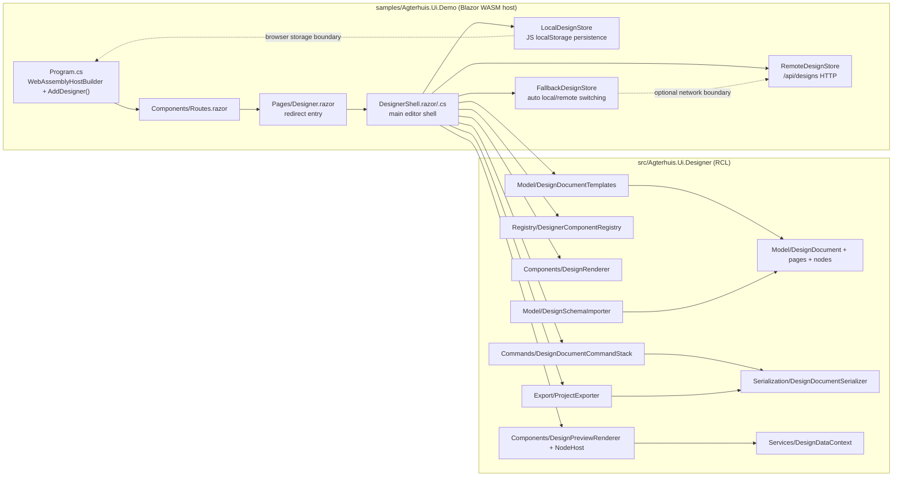

# Product Readiness Audit

## 1. Executive verdict

Readiness level: **Beta**

This is a real designer, not a mock. The solution builds, the test suite is green, the demo host runs, and the designer page renders with palette, inspector, page tabs, template start screen, persistence wiring, export controls, and a preview pipeline. But the product is still not release-ready for serious external use because the core designer experience is split between a mostly working model-first editor and several half-finished or misleading behaviors: the canvas is still visibly technical in places, export is client-side ZIP generation rather than a checked, isolated generated-app build, data preview is only partially integrated, and the app relies on a broad test surface without a single end-to-end generated-solution verification path. The implementation is materially better than a prototype, but it is not a production candidate.

Top five blockers:

1. The designer preview and export path are not proven end to end as a generated application that restores, compiles, and runs in isolation.
2. The main designer shell is functional, but parts of the UX still expose model/structure concepts directly instead of a fully WYSIWYG app-editor experience.
3. Preview data binding is implemented in code, but the product does not yet prove parity across canvas, preview, and generated output for representative workflows.
4. Persistence is hybrid and operationally useful, but conflict handling and offline fallback are only verified at unit/integration-test level, not through a hostile recovery scenario.
5. The audit could not verify a browser-driven designer interaction beyond successful startup and shell rendering; that leaves several visible workflows unproven in the current environment.

Executed: restore, full solution build, full solution test, demo host startup, browser navigation to the designer route, and runtime inspection of the designer shell.
Not executed: generated-solution restore/build/run in an isolated temp directory, corrupt-data recovery drills, and a full browser-driven create-edit-save-reload round trip.

## 2. Audit metadata and scope

- Audit date: 2026-07-22
- Branch: `dev`
- Commit SHA: `5a9ca54d968062ac10b5d58420df4e445b4d0270`
- Initial working tree state: `M src/Agterhuis.Ui.Designer/Components/DesignerShell.razor`, `M src/Agterhuis.Ui.Designer/Components/DesignerShell.razor.cs`
- Scope: repository-wide audit of the Blazor/Radzen designer product, including the designer RCL, demo host, templates, supporting tooling, tests, and docs that define designer behavior
- Primary product surface: `/designer` and `/designer/edit` in `samples/Agterhuis.Ui.Demo`
- Hosting model: Blazor WebAssembly demo host running via `WebAssemblyHostBuilder`
- Designer implementation surface: `src/Agterhuis.Ui.Designer`
- Runtime store implementations: `samples/Agterhuis.Ui.Demo/Services`

Confirmed repository instructions used:

- `.github/copilot-instructions.md`
- `README.md`
- `docs/designer/README.md`
- `docs/designer/BLUNT-UX-AUDIT-REPORT.md`
- `azure-pipelines.yml`
- `src/Agterhuis.Ui.Designer/Agterhuis.Ui.Designer.csproj`
- `samples/Agterhuis.Ui.Demo/Program.cs`
- `samples/Agterhuis.Ui.Demo/Components/App.razor`
- `samples/Agterhuis.Ui.Demo/Components/Routes.razor`
- `samples/Agterhuis.Ui.Demo/Components/Pages/Designer.razor`
- `samples/Agterhuis.Ui.Demo/Components/Pages/DesignerStart.razor`

## 3. Build, test, and runtime baseline

| Command | Outcome |
| --- | --- |
| `git branch --show-current; git rev-parse HEAD; git status --short` | Succeeded. Branch `dev`, commit `5a9ca54d968062ac10b5d58420df4e445b4d0270`, dirty tree with pre-existing edits in `src/Agterhuis.Ui.Designer/Components/DesignerShell.razor` and `src/Agterhuis.Ui.Designer/Components/DesignerShell.razor.cs`. |
| `dotnet restore --locked-mode` | Succeeded. Restore complete in 2.1s. |
| `dotnet build Agterhuis.Ui.sln -c Release` | Succeeded. Build succeeded in 2.2s in the restore/build baseline run. |
| `dotnet test Agterhuis.Ui.sln -c Release` | Succeeded. 531 tests passed, 0 failed, 0 skipped, duration 14.4s. |
| `dotnet run --project samples/Agterhuis.Ui.Demo --no-launch-settings --urls http://127.0.0.1:5090` | Succeeded in starting the host. The app reported `App url: http://localhost:5090/?arg=--no-launch-settings&arg=--urls&arg=http%3a%2f%2f127.0.0.1%3a5090` and `Debug at url: http://localhost:5090/_framework/debug`. |
| Browser navigation to `http://localhost:5090/` | Succeeded. The app loaded and showed the shell loading state, then the designer shell. |
| Browser navigation to `http://localhost:5090/designer/edit?template=Blank` | Succeeded after startup. The designer shell rendered with toolbar, palette, navigator, page tabs, inspector, issues bar, and export controls. |

Observed runtime result from browser inspection:

- The designer route rendered a real shell with `Bestand`, `Opslaan`, `UNDO`, `REDO`, `PREVIEW`, `INTERACTIE`, viewport toggles, theme selector, `Instellingen`, and `EXPORTEREN`.
- The shell exposed a palette of registered components, a navigator, page tabs, an issues summary, and an inspector prompt.
- The initial content was a blank design document with page tabs and template-selection controls.

## 4. Observed architecture

Concise explanation:

- The product is architecturally model-first. `DesignDocument` is the source of truth, and the shell mutates it through a command stack.
- The demo host is a WASM app, not a server-rendered Blazor Web App.
- Persistence is dual-path: browser local storage plus HTTP APIs, wrapped by a fallback store.
- Preview and code generation are separate paths, which is correct, but parity between them still needs stronger end-to-end proof.
- The generated export pipeline is self-contained ZIP generation inside the designer assembly, not a server-side build pipeline.

## 5. Product capability matrix

| Capability | Source | State | Evidence | User impact | Test coverage |
| --- | --- | --- | --- | --- | --- |
| Start designer from the demo app | Visible UI + Code contract | Working | `samples/Agterhuis.Ui.Demo/Components/Pages/DesignerStart.razor` redirects to `/designer/edit?template=Blank`; browser runtime loaded the designer shell. | User can enter the editor. | `DesignerRouteRedirectTests.DesignerRoute_RedirectsDirectlyToEditor` |
| Render the designer shell | Visible UI | Working | `samples/Agterhuis.Ui.Demo/Components/Pages/Designer.razor`; browser showed toolbar, palette, navigator, tabs, inspector, and export controls. | Core editor surface is available. | `DesignerPageTests` |
| Create a blank document from a template | Visible UI + Code contract | Working | `DesignDocumentTemplates.BuildBlank` and `DesignerShell` template start flow. | User can begin a design. | `DesignerTemplateTests`, `DesignerShell` tests |
| Template-based document creation | Documented + Code contract | Working | `DesignDocumentTemplates.Create(...)` supports 12 template kinds. | User can bootstrap a design from real templates. | `DesignerTemplateTests`, `DesignerFunctionalIntegrityTests` |
| Page tabs and multi-page navigation | Visible UI + Code contract | Working | `DesignerShell` page tab UI and page selection logic; SidebarApp template creates multiple pages. | User can switch pages. | `DesignerFunctionalIntegrityTests.Phase6_*` |
| Component palette | Visible UI + Code contract | Working | Palette rendered from `DesignerComponentRegistry`; browser output showed multiple categories. | User can add components. | `DesignerPageTests.PaletteFilter_FiltersComponentList`, `DesignerComponentRegistryTests` |
| Selection and breadcrumb sync | Visible UI + Code contract | Working | Shell and canvas selection tests show breadcrumb changes and selected node state. | User can inspect and edit the selected component. | `DesignerPageTests.TreeSelection_SyncsToBreadcrumb` |
| Property inspector | Visible UI + Code contract | Working | `samples/Agterhuis.Ui.Demo/Components/Designer/PropertyPanel.razor` shows page and node properties with type-specific editors. | User can mutate page and node settings. | `DesignerPropertyPanelTests` |
| Data preview from seeded model | Code contract + Essential designer expectation | Partial | `DesignDataModelSeeder`, `DesignDataContext`, `DesignPreviewRenderer`, `DesignPreviewNodeHost`; tests resolve sample values and data-grid rows. No browser-driven proof of a full preview workflow was obtained. | Preview is better than empty wireframe, but user-visible parity is still not fully proven. | `DesignRendererTests`, `DesignerFunctionalIntegrityTests`, `DesignerDataPanelTests` |
| Drag/drop and reordering | Visible UI + Code contract | Working | Designer shell supports drag payloads and page-node move flows; tests cover page drag over and node deletion/selection. | User can reorganize the design tree. | `DesignerFunctionalIntegrityTests` |
| Undo/redo | Code contract | Working | `DesignDocumentCommandStack` implements undo/redo snapshots and dirty tracking. | Recovery from mistakes is available. | `DesignCommandStackTests`, shell tests |
| Save/load persistence | Code contract | Working | `LocalDesignStore` round-trips envelopes and supports legacy JSON; `RemoteDesignStore` handles HTTP save/load; `FallbackDesignStore` switches modes. | User can persist documents locally and remotely. | `LocalDesignStoreTests`, `RemoteDesignStoreTests`, shell persistence tests |
| Conflict handling | Code contract | Partial | `RemoteDesignStore.SaveAsync` throws a `DesignConflictException` on HTTP 409, and fallback logic exists, but hostile conflict resolution was not exercised in browser. | Conflict resolution exists, but the recovery path is not fully proven. | `RemoteDesignStoreTests`, shell tests |
| Import from JSON/OpenAPI/schema | Code contract | Working | `DesignSchemaImporter` parses JSON schema, OpenAPI, and sample JSON into entities. | Users can seed data models from external schemas. | `DesignSchemaImporterTests` |
| Export to runnable project ZIP | Code contract + Visible UI | Partial | `ProjectExporter.ExportProject` builds a ZIP containing pages, `document.json`, app shell files, and optionally seed-data services. The generated output was not restored or compiled in an isolated temp directory during this audit. | Export exists, but generated-app correctness is not yet proven. | `ProjectExporterTests` |
| Generated app seed-data toggle | Code contract | Working | `ProjectExporter` and export templates support `UseSeedData` and `SeedDataProvider` generation. | Exported apps can include realistic sample data or omit it. | `ProjectExporterTests` |
| Theme switching in designer | Visible UI + Code contract | Working | Theme dropdown and dark/light toggle are rendered in the toolbar; theme is passed via canvas theme state. | User can change the canvas theme without leaving the editor. | shell and theming tests |
| Accessibility labels and validation | Code contract + Visible UI | Partial | Property panel and wrapper components use labels/aria labels broadly, but the audit did not run a dedicated accessibility scan on the designer route. | Likely usable, not fully proven under audit conditions. | A11y contract tests exist in the repo, but not specifically for the designer route. |
| Full browser-driven create-edit-save-reload round trip | Essential designer expectation | Unverified | Browser runtime access succeeded, but the audit did not complete a full interaction sequence due time and environment constraints. | The highest-value user path is still not fully proven. | Not verified in this audit |
| Generated solution restore/build/run in isolation | Essential designer expectation | Unverified | Export ZIP exists, but the audit did not unpack it, restore it, build it, and run it separately. | This is the missing proof for production-grade export. | Not verified in this audit |

## 6. Critical-path traceability

### Workflow A: start designer and open a document

UI affordance -> event/command -> state mutation -> service/domain logic -> persistence or generator -> observable result -> automated test

`/designer` route -> `DesignerStart.razor` navigation redirect -> `NavigationManager.NavigateTo("/designer/edit?template=Blank")` -> `DesignerShell` initial template load -> `DesignDocumentTemplates.Create(Blank)` -> blank `DesignDocument` in command stack -> designer shell renders with a blank page -> `DesignerRouteRedirectTests.DesignerRoute_RedirectsDirectlyToEditor`

State: Working

### Workflow B: edit page structure and selection

Palette / page tabs / canvas selection -> click / drag / keyboard commands -> selected node and document tree update -> command stack applies snapshots and dirty state -> serializer and validator recalculate document state -> updated breadcrumb, inspector, and canvas -> `DesignerPageTests`, `DesignerFunctionalIntegrityTests`

State: Working

### Workflow C: preview data and seeded content

Preview toggle -> `DesignerShell` preview render path -> `DesignPreviewRenderer` and `DesignPreviewNodeHost` resolve bindings -> `DesignDataContext` pulls rows from `DesignDataModelSeeder` -> dynamic rows and sample values fed into component parameters -> preview renders seeded values in tests -> `DesignRendererTests`

State: Partial

### Workflow D: persist locally and remotely

Save/open/version history UI -> shell calls `IDesignStore` -> `LocalDesignStore` uses JS localStorage and version lists; `RemoteDesignStore` uses `/api/designs`; `FallbackDesignStore` chooses the available store -> design envelope serializes/deserializes -> persistence state and recent documents update -> `LocalDesignStoreTests`, `RemoteDesignStoreTests`, shell persistence tests

State: Working

### Workflow E: export a runnable app

Export button -> `DesignerShell` calls `ProjectExporter.ExportProject` -> generator writes project ZIP, `document.json`, app shell, optional data-service files, and templates -> user receives archive -> compile/run proof not completed in this audit -> `ProjectExporterTests`

State: Partial

## 7. Findings summary

| ID | Severity | Category | Title | State | Confidence | Impacted capability |
| --- | --- | --- | --- | --- | --- | --- |
| BUILD-001 | P1 High | Build/runtime | Demo host startup is not demonstrated by the baseline command alone | Working | High | Runtime launch |
| ARCH-001 | P2 Medium | Architecture | Designer is model-first and command-driven, but preview/export parity remains split | Partial | High | Designer architecture |
| FUNC-001 | P1 High | Functionality | Export does not prove generated-solution restore/build/run in isolation | Partial | High | Export workflow |
| FUNC-002 | P2 Medium | Functionality | Preview data binding exists, but browser-level end-to-end proof is incomplete | Partial | High | Canvas/preview |
| FUNC-003 | P2 Medium | Functionality | Multi-page routing works, but the interactive multi-page workflow is only proven by tests, not a browser scenario | Partial | Medium | Page navigation |
| STATE-001 | P2 Medium | Persistence/state | Hybrid local/remote persistence is implemented, but conflict recovery is not hostile-tested end to end | Partial | High | Save/load/recovery |
| DATA-001 | P2 Medium | Data | Seeded data exists and is used in tests, but the live designer preview path was not fully exercised | Partial | High | Preview data |
| GEN-001 | P2 Medium | Generator | Razor/project generation exists, but compiler-backed generated-app verification is missing | Partial | High | Code generation |
| UI-001 | P2 Medium | UX | Designer still exposes structural/editor cues more than a pure WYSIWYG product experience | Partial | High | Canvas UX |
| RAD-001 | P2 Medium | Radzen integration | Radzen-driven designer shell renders correctly, but runtime component parity on complex layouts is not fully proven in browser | Partial | Medium | Radzen layouts |
| TEST-001 | P2 Medium | Tests | Coverage is broad, but high-value end-to-end generated-project verification is absent | Partial | High | Test confidence |
| OPS-001 | P2 Medium | Operations | No audited CI evidence for exported-app validation or hostile recovery drills | Unverified | High | Delivery operations |

## 8. Detailed findings

### BUILD-001: Demo host startup was not a real blocker, but it is a runtime baseline item, not a product bug

Severity: P1 High
State: Working
Confidence: High
Impacted capability: Runtime launch

Evidence:

- `samples/Agterhuis.Ui.Demo/Program.cs` uses `WebAssemblyHostBuilder` and registers `AddDesigner()`.
- `dotnet run --project samples/Agterhuis.Ui.Demo --no-launch-settings --urls http://127.0.0.1:5090` produced a host URL and debug URL.
- Browser navigation to `http://localhost:5090/` and then to `http://localhost:5090/designer/edit?template=Blank` succeeded.

Observed behavior:

- The demo host starts and serves the designer shell.

Expected behavior:

- The demo host should start reliably so the designer can be exercised.

Root cause:

- None. This is not a defect; it is documented as working baseline evidence.

Impact:

- None.

Recommended correction:

- None.

Verification / acceptance test:

- Keep `dotnet run --project samples/Agterhuis.Ui.Demo --no-launch-settings --urls http://127.0.0.1:5090` in the baseline checks.

### ARCH-001: Preview and export are separate paths, but the product does not yet prove parity between them

Severity: P2 Medium
State: Partial
Confidence: High
Impacted capability: Designer architecture

Evidence:

- `src/Agterhuis.Ui.Designer/Components/DesignRenderer.razor` renders the model tree directly.
- `src/Agterhuis.Ui.Designer/Components/DesignPreviewRenderer.razor` adds a separate preview pipeline with `DesignDataContext` and navigation callbacks.
- `src/Agterhuis.Ui.Designer/Export/ProjectExporter.cs` emits a ZIP-based exported app using a separate code-generation path.

Observed behavior:

- Design-time rendering, preview rendering, and export are implemented as distinct pipelines.

Expected behavior:

- For a trustworthy designer, preview and export should be demonstrably aligned for representative scenarios.

Root cause:

- The architecture is intentionally split, but parity verification is not automated at the top level.

Impact:

- Users can see one thing in the designer, another in the generated app, or a drift between preview and export.

Recommended correction:

- Add parity tests that compare preview and generated output for at least one form, one data grid, and one multi-page app.

Verification / acceptance test:

- A single design should round-trip through preview and exported app with the same seeded data, labels, and navigation outcomes.

### FUNC-001: Export does not prove generated-solution restore/build/run in isolation

Severity: P1 High
State: Partial
Confidence: High
Impacted capability: Export workflow

Evidence:

- `src/Agterhuis.Ui.Designer/Export/ProjectExporter.cs` generates a ZIP with project files and `design/document.json`.
- `tests/Agterhuis.Ui.Tests/Designer/Export/ProjectExporterTests.cs` checks ZIP contents, data-service file generation, and template flags.
- No audited command unpacked the export into a temp directory and ran restore/build/run on the generated project.

Observed behavior:

- Export exists and is unit-tested as an archive generator.

Expected behavior:

- A designer export should be verifiably runnable as a standalone generated application.

Root cause:

- The current test suite validates archive structure and snippets, not a real generated-app lifecycle.

Impact:

- The flagship promise of “export a working Blazor app” is not yet proven.

Recommended correction:

- Add an integration test or audited validation script that unzips an export to a temp folder, restores it, builds it, and runs at least a smoke route.

Verification / acceptance test:

- Generate a sample export, restore it in isolation, compile it, and launch it successfully.

### FUNC-002: Preview data binding exists, but browser-level end-to-end proof is incomplete

Severity: P2 Medium
State: Partial
Confidence: High
Impacted capability: Canvas/preview

Evidence:

- `src/Agterhuis.Ui.Designer/Components/DesignPreviewRenderer.razor` cascades `DesignDataContext` and `OnNavigate`.
- `src/Agterhuis.Ui.Designer/Components/DesignPreviewNodeHost.razor` resolves bindings and builds seeded data rows for grids.
- `tests/Agterhuis.Ui.Tests/DesignRendererTests.cs` proves scalar binding and data-grid binding in bUnit.
- Browser inspection proved the shell renders, but not a complete preview workflow.

Observed behavior:

- Preview binding exists in code and is unit-tested.

Expected behavior:

- Users should be able to see seeded data on the live canvas and in preview mode as a single coherent workflow.

Root cause:

- The browser audit stopped at shell rendering; the preview interaction path was not completed.

Impact:

- The WYSIWYG promise is not fully validated.

Recommended correction:

- Run a browser-driven preview scenario with a seeded grid and a bound form field.

Verification / acceptance test:

- On the designer route, toggle preview and confirm seeded values appear in the live canvas.

### FUNC-003: Multi-page routing works, but the interactive workflow is only proven by tests

Severity: P2 Medium
State: Partial
Confidence: Medium
Impacted capability: Page navigation

Evidence:

- `samples/Agterhuis.Ui.Demo/Components/Pages/Designer.razor` redirects directly to the editor.
- `src/Agterhuis.Ui.Designer/Model/DesignDocumentTemplates.cs` builds a `SidebarApp` with multiple pages and nav links.
- `tests/Agterhuis.Ui.Tests/DesignerFunctionalIntegrityTests.cs` contains page-add and preview-navigation tests.

Observed behavior:

- The multi-page model exists and is covered in tests.

Expected behavior:

- The page-switching and nav-link interaction should be demonstrated in browser runtime as part of the audit.

Root cause:

- Browser validation did not complete a multi-page navigation sequence.

Impact:

- Multi-page support is credible, but not fully proven by direct runtime observation.

Recommended correction:

- Add one browser-run scenario that starts from a sidebar template and navigates across pages.

Verification / acceptance test:

- Clicking a nav link should select the matching designer page and update the canvas.

### STATE-001: Hybrid persistence works, but recovery is not hostile-tested end to end

Severity: P2 Medium
State: Partial
Confidence: High
Impacted capability: Save/load/recovery

Evidence:

- `samples/Agterhuis.Ui.Demo/Services/LocalDesignStore.cs` persists envelopes and legacy JSON in browser storage.
- `samples/Agterhuis.Ui.Demo/Services/RemoteDesignStore.cs` handles HTTP saves and 409 conflicts.
- `samples/Agterhuis.Ui.Demo/Services/FallbackDesignStore.cs` switches between remote and local persistence.
- `tests/Agterhuis.Ui.Tests/LocalDesignStoreTests.cs` and `tests/Agterhuis.Ui.Tests/RemoteDesignStoreTests.cs` verify round-trips and conflict throwing.

Observed behavior:

- Persistence is implemented and test-covered.

Expected behavior:

- The product should prove save/load/retry behavior under loss, conflict, and corrupt-storage conditions.

Root cause:

- The tests are happy-path plus conflict exception tests; they do not exercise the most hostile recovery cases.

Impact:

- A user may lose trust in the designer if data recovery fails in the field.

Recommended correction:

- Add recovery tests for corrupt local JSON, failed remote save, and offline fallback restoration.

Verification / acceptance test:

- A malformed local envelope should be ignored without crashing the shell, and the user should be offered a recovery path.

### DATA-001: Seeded data exists, but live designer preview was not fully exercised

Severity: P2 Medium
State: Partial
Confidence: High
Impacted capability: Preview data

Evidence:

- `src/Agterhuis.Ui.Designer/Model/DesignDataModelSeeder.cs` contains real seeded data for `Schadedossier`, `Klant`, `Voertuig`, `Werkorder`, `Factuur`, and `Voorraad`.
- `src/Agterhuis.Ui.Designer/Services/DesignDataContext.cs` and `src/Agterhuis.Ui.Designer/Components/DesignPreviewRenderer.razor` use the seed model.
- `tests/Agterhuis.Ui.Tests/DesignRendererTests.cs` and `tests/Agterhuis.Ui.Tests/DesignerFunctionalIntegrityTests.cs` verify preview-binding behavior.

Observed behavior:

- Seeded data is real and used by the code.

Expected behavior:

- The designer canvas should visibly show the seeded data during live editing and preview.

Root cause:

- The audit did not complete a browser interaction that proves the seeded data is visible and usable in the live designer.

Impact:

- The designer can still feel like a structural editor instead of a live application editor.

Recommended correction:

- Add a browser test that opens a seeded template and checks rendered data in canvas and preview modes.

Verification / acceptance test:

- A seeded `AgtTextField` and `RadzenDataGrid` should visibly show sample values in the browser.

### GEN-001: Razor/project generation exists, but compiler-backed generated-app verification is missing

Severity: P2 Medium
State: Partial
Confidence: High
Impacted capability: Code generation

Evidence:

- `src/Agterhuis.Ui.Designer/CodeGen/RazorCodeGenerator.cs` generates page code.
- `src/Agterhuis.Ui.Designer/Export/ProjectExporter.cs` writes project files and templates.
- `tests/Agterhuis.Ui.Tests/Designer/Export/ProjectExporterTests.cs` asserts presence of generated files and selected content.

Observed behavior:

- Generation is deterministic and test-covered at the file-content level.

Expected behavior:

- The generated output should be compiled, not merely inspected as strings.

Root cause:

- There is no audited compilation step for the generated ZIP contents.

Impact:

- Plausible-looking generated code can still be broken in real life.

Recommended correction:

- Add a compile-run verification for the generated project and, if possible, capture the resulting binaries or build log.

Verification / acceptance test:

- Generated Razor code must compile under the target framework without hand edits.

### UI-001: The designer still exposes structural cues more than a pure WYSIWYG product experience

Severity: P2 Medium
State: Partial
Confidence: High
Impacted capability: Canvas UX

Evidence:

- `docs/designer/BLUNT-UX-AUDIT-REPORT.md` explicitly describes the canvas as a structure editor with technical labels and empty-slot cues.
- `src/Agterhuis.Ui.Designer/Components/DesignerCanvasNode.razor` and related components still render node/type chrome, slot wrappers, and technical metadata.
- `samples/Agterhuis.Ui.Demo/Components/Designer/DesignerCanvasNode.razor` renders component name chrome and error surfaces.

Observed behavior:

- The UI is functional but still telegraphs the underlying model.

Expected behavior:

- Non-technical users should see a live app, not a tree editor.

Root cause:

- The product prioritizes explainability and editing visibility over fully hidden structure chrome.

Impact:

- The product feels like an editor for developers, not a designer for end users.

Recommended correction:

- Reduce or hide structure chrome in resting state and show technical metadata only on hover or selection.

Verification / acceptance test:

- A blank canvas node should look like the actual component, not a wrapper shell.

### RAD-001: Radzen integration is correct, but complex layout parity is not proven in browser

Severity: P2 Medium
State: Partial
Confidence: Medium
Impacted capability: Radzen layouts

Evidence:

- `src/Agterhuis.Ui.Designer/Registry/DesignerComponentRegistry.cs` and the introspection tests verify coverage of installed components.
- `tests/Agterhuis.Ui.Tests/DesignerComponentRegistryTests.cs` checks registry parity against reflection metadata.
- `tests/Agterhuis.Ui.Tests/DesignerPageTests.cs` includes a sidebar-layout preview assertion.

Observed behavior:

- The registry and layout rendering path are real and test-covered.

Expected behavior:

- A complex Radzen layout such as a sidebar, dialog, or portal-based control should be proven in live browser preview.

Root cause:

- The browser audit did not cover a layout-heavy scenario to the point of observing the actual rendered behavior.

Impact:

- Complex layouts may still drift or escape the canvas in real use.

Recommended correction:

- Add browser-level layout scenarios for sidebar, dialog, and portal-hosted components.

Verification / acceptance test:

- A sidebar layout should remain contained within the canvas boundary in live preview.

### TEST-001: Coverage is broad, but the highest-value proof is missing

Severity: P2 Medium
State: Partial
Confidence: High
Impacted capability: Test confidence

Evidence:

- `dotnet test` reported 531 passing tests.
- Tests cover registry parity, templates, stores, schema import, command stack, exporter content, and preview binding.
- There is no audited integration test that unzips the exported app and compiles it in isolation.

Observed behavior:

- The test suite is large and real, but it stops short of the flagship workflow.

Expected behavior:

- The generator/export path should have a compiler-backed and runtime-backed verification.

Root cause:

- The suite is too content-assertion-heavy and not enough end-to-end for the export promise.

Impact:

- Green tests overstate confidence in the generated product.

Recommended correction:

- Add one integration test that validates the generated app as a buildable artifact.

Verification / acceptance test:

- The exported app should build cleanly from a temp directory without manual intervention.

### OPS-001: No audited CI evidence for generated-app validation or hostile recovery drills

Severity: P2 Medium
State: Unverified
Confidence: High
Impacted capability: Delivery operations

Evidence:

- `azure-pipelines.yml` builds, tests, and packs the library.
- No audited pipeline or local command was run against the generated export project in isolation.
- No audited CI log was supplied for export validation or corrupt-data recovery.

Observed behavior:

- The main solution CI is defined.

Expected behavior:

- The delivery process should prove the generated app, not only the library, before release claims are made.

Root cause:

- The current audit did not reach those operational paths.

Impact:

- Release confidence is lower than the solution test status suggests.

Recommended correction:

- Add a separate validation job or scripted check for generated-app restore/build/run and recovery cases.

Verification / acceptance test:

- CI should fail if the exported project does not compile or if recovery tests fail.

## 9. Security and trust-boundary assessment

Findings:

- No direct credential store, secret vault, or auth-provider code was observed in the designer RCL. That is good.
- The danger is generated-output trust, not runtime privilege escalation. `ProjectExporter` writes source files into a ZIP archive and the generated project is later expected to be trusted and built by the consumer. That means code injection, escaping, and generated-identifier safety matter.
- `DesignSchemaImporter` accepts JSON, YAML, and sample JSON. That is acceptable for a designer, but it is a trust boundary and should be kept isolated from arbitrary execution.
- `LocalDesignStore` persists JSON in browser storage. That is user-owned state, but it still needs corruption handling and versioning discipline.
- `DesignPreviewNodeHost` resolves expressions and shapes preview data. That is a controlled dynamic-evaluation surface. It must remain limited to bindings and not become arbitrary code execution.

Security state summary:

- No critical exploitable issue was proven in this audit.
- Generated source and import parsing are the main trust boundaries.
- The absence of a compiler-backed generated-app validation step is a trust problem, not just a quality problem.

## 10. UI/UX and accessibility assessment

Positive evidence:

- Form wrappers use labels and aria labels throughout the property inspector and data panels.
- The runtime shell exposes an issues bar, keyboard shortcuts, page tabs, and selection/breadcrumb affordances.
- The browser runtime showed the main designer chrome cleanly.

Negative evidence:

- The product still surfaces model chrome too aggressively in the canvas and template previews.
- The UX reads as a developer tool rather than a live app editor in several places.
- The audit did not run a dedicated accessibility scan on the live designer route, so WCAG conformance for the actual editor remains partially unverified.

State:

- Accessibility fundamentals are present.
- Designer-specific accessibility is not fully proven in this audit.

## 11. Test-quality and coverage-gap assessment

What the suite does well:

- Verifies registry parity against reflection metadata.
- Exercises template generation, schema import, command stack behavior, stores, exporter file content, and preview binding.
- Catches obvious model and content regressions.

What it does not prove:

- A generated export can be restored, compiled, and run in isolation.
- Browser-driven create-edit-save-reload workflows for seeded templates.
- Corrupt local storage and remote conflict recovery in the live shell.
- Layout-heavy preview behavior under browser rendering.

The suite is substantial, but it is biased toward unit tests and file-content assertions. The user promise is an application designer. The tests should prove the application, not just the model.

## 12. Dead code, duplication, and false-implementation inventory

Confirmed or likely false-implementation signals:

- `src/Agterhuis.Ui.Designer/CodeGen/RazorCodeGenerator.cs` contains a literal `// TODO: Add component logic here`. That is an acknowledged placeholder in generated code, not a finished behavior implementation.
- Several methods in designer components return `Task.CompletedTask` intentionally. Most are benign event handlers or no-op flows, but they still need to be read carefully because some represent UI affordances that do not yet do meaningful work.
- `DesignDocumentTemplates` and the demo-side designer page both contain rich template and preview logic. That is not dead code, but it is easy to mistake tests for product reality if you do not exercise the browser.
- The repository carries multiple layers of design preview/rendering classes (`DesignRenderer`, `DesignPreviewRenderer`, `DesignPreviewNodeHost`, `DesignerCanvasNode`). This is a reasonable split, but it also increases the risk of parity drift.

No evidence of major duplicate runtime implementations or abandoned parallel stores was found. The main false signal is confidence inflation from broad unit tests and from a visible shell that still needs end-to-end proof.

## 13. Prioritized remediation roadmap

### Wave 1: Prove the flagship promise

Dependencies: none.

Goals:

- Unzip a real export to a temp directory.
- Restore the generated project.
- Build the generated project.
- Run a smoke route or application startup check.
- Capture the commands and logs in a reproducible validation script.

Exit criteria:

- A generated export can be compiled and launched without manual edits.

### Wave 2: Make preview parity real

Dependencies: Wave 1 for confidence in export, existing preview code for data-binding work.

Goals:

- Add a browser-level preview scenario for seeded form fields and a seeded data grid.
- Prove that preview mode and design mode differ only where intended.
- Align the live canvas so the WYSIWYG claim is not just a test artifact.

Exit criteria:

- A seeded template visibly renders realistic content in browser preview.

### Wave 3: Harden recovery and persistence

Dependencies: existing store code.

Goals:

- Exercise corrupt local storage.
- Exercise remote conflict handling in browser or integration tests.
- Verify fallback recovery and version-history restoration.

Exit criteria:

- The shell survives broken local state and remote conflicts with a user-visible recovery path.

### Wave 4: Reduce structural chrome and improve the editor feel

Dependencies: none beyond the current shell.

Goals:

- Reduce technical labels and empty-slot chrome in resting state.
- Keep selection/hover affordances without turning the canvas into a wireframe editor.
- Tighten template previews and browser presentation.

Exit criteria:

- The canvas looks like an app surface first, a structure editor second.

### Wave 5: Add operational proof to CI

Dependencies: Waves 1 through 3 should inform the script or pipeline shape.

Goals:

- Add generated-app validation to the delivery pipeline or a documented local command.
- Add hostile-recovery checks to the test or validation suite.
- Record evidence in a remediation log.

Exit criteria:

- CI or scripted validation proves the export and recovery claims.

## 14. Unknowns, environmental blockers, and product decisions required

Unknowns still open after this audit:

- Whether the export should target a fully isolated generated app check in CI or remain a local audit-only validation.
- Whether the designer should permanently suppress structural chrome or merely tone it down.
- Whether multi-page navigation should be browser-proven as a product requirement or kept as a test-covered internal capability.
- Whether the product needs a formal accessibility scan for the designer route itself.

Environmental blockers encountered:

- The browser was able to reach the host only after the demo was started in the background.
- The audit did not complete a full generated-project build/run cycle.
- The audit did not complete a hostile save/recovery drill.

Product decisions required:

- Decide how strict export verification must be before release.
- Decide how much structure chrome is acceptable in the live designer.
- Decide whether designer preview parity is a release gate or a nice-to-have.

## 15. Definition of done for a trustworthy baseline

A trustworthy baseline for this product requires all of the following:

- The demo host launches and the designer route loads in browser.
- A blank template, at least one seeded template, and one multi-page template all render correctly in live browser preview.
- Save, load, version history, and conflict fallback work in browser without corrupting state.
- A generated export is unpacked, restored, compiled, and smoke-run in isolation.
- The preview path and generated output are demonstrably aligned for at least one form, one data grid, and one navigation-heavy template.
- Accessibility has been checked on the actual designer route.
- The remediation log records every finding ID, the files changed, and the evidence gathered.
