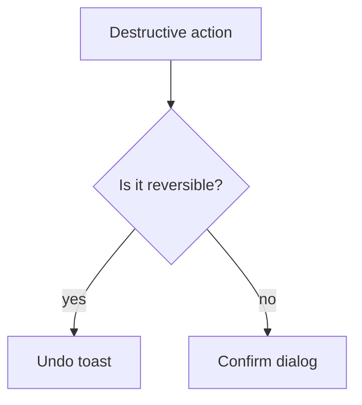

# Bevestiging & destructieve acties

## Wanneer gebruik je dit

Gebruik dit patroon voor acties die data verwijderen, terugdraaien of moeilijk herstellen zijn.

## Anatomie

## Do

- Gebruik een confirm dialog voor irreversibele acties.
- Gebruik undo wanneer de actie snel te herstellen is.
- Houd de tekst expliciet over het gevolg.

## Don't

- Vraag om bevestiging voor acties die al veilig ongedaan kunnen worden gemaakt.

## Live reference

- Demo: `/components/feedback/confirm-dialog`
- Showcase: `/app/werkorders`
