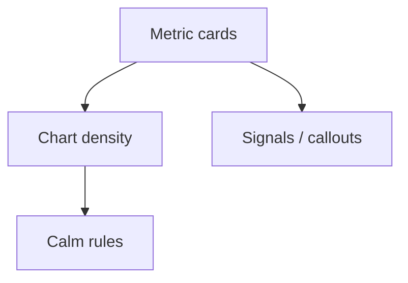

# Dashboard

## Wanneer gebruik je dit

Gebruik dit patroon voor operationele overzichten met samenvattende metrics, status en prioriteit.

## Anatomie

## Do

- Houd metrics compact en scanbaar.
- Gebruik grafieken alleen als ze beslissingen versnellen.
- Respecteer calm routes: geen overbodige motion.

## Don't

- Vervang een duidelijke tabel door een grafiek zonder extra waarde.

## Live reference

- Demo: `/`
- Showcase: `/app/werkorders`
