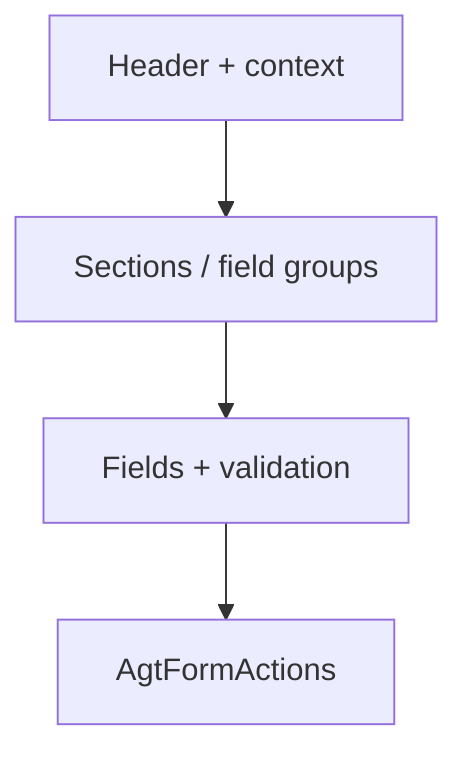

# Formulierpagina

## Wanneer gebruik je dit

Gebruik dit patroon voor create- en editflows waarin gebruikers gegevens één keer of in kleine stappen invoeren.

## Anatomie

## Do

- Groepeer velden in logische secties.
- Laat labels zichtbaar.
- Toon validatie pas wanneer de gebruiker iets kan herstellen.

## Don't

- Verstop het formulier achter een generieke modal zonder context.
- Gebruik geen enkele knop zonder duidelijke actie.

## Live reference

- Demo: `/components/forms/form-actions`
- Showcase: `/app/instellingen` en `/app/werkorders`
