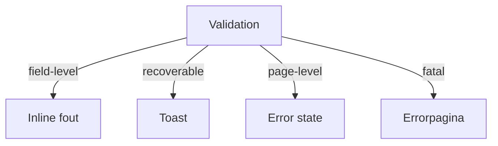

# Foutafhandeling

## Wanneer gebruik je dit

Gebruik dit patroon om te bepalen welke fout op welke plek zichtbaar moet zijn.

## Anatomie

## Do

- Laat veldfouten naast het veld zien.
- Gebruik een toast voor een afgeronde, herstelbare actie.
- Gebruik een error state of pagina voor structurele problemen.

## Don't

- Zet technische foutcodes vooraan in de tekst.

## Live reference

- Demo: `/Error`
- Showcase: `/app/werkorders`
