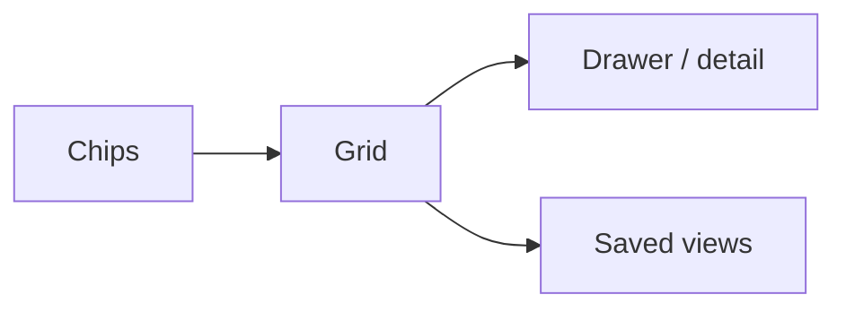

# Lijst / CRUD-pagina

## Wanneer gebruik je dit

Gebruik dit patroon voor overzichtsschermen waar gebruikers filteren, selecteren, openen en wijzigen.

## Anatomie

## Do

- Houd filters direct zichtbaar.
- Gebruik saved views voor terugkerende taken.
- Laat detailcontext naast de lijst volgen als de taak dat toelaat.

## Don't

- Verplaats elke actie naar een losse pagina als de gebruiker in dezelfde context blijft werken.

## Live reference

- Demo: `/components/data/grid`
- Showcase: `/app/werkorders`
