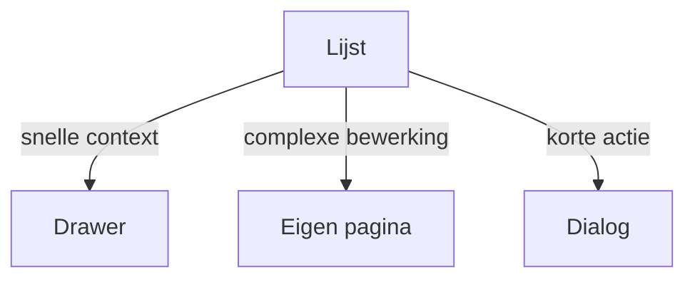

# Master-detail

## Wanneer gebruik je dit

Gebruik dit patroon wanneer een lijst de hoofdtaak is en detailinformatie snel beschikbaar moet zijn.

## Anatomie

## Do

- Kies drawer voor contextbehoud.
- Kies dialog voor korte beslissingen.
- Kies een eigen pagina voor complexe bewerkingen.

## Don't

- Gebruik een dialog voor een detailflow die meerdere velden of secties nodig heeft.

## Live reference

- Demo: `/components/layout/tabs`
- Showcase: `/app/klanten`
