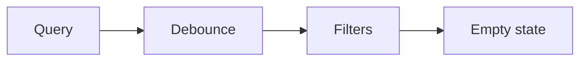

# Zoeken & filteren

## Wanneer gebruik je dit

Gebruik dit patroon voor snelle verkenning van datasets en terugkerende zoekacties.

## Anatomie

## Do

- Debounce vrije tekstzoeking.
- Maak filters goed zichtbaar.
- Bied altijd een duidelijke `Wis filters`-actie.

## Don't

- Laat gebruikers raden welke filter combinatie actief is.

## Live reference

- Demo: `/components/feedback/empty-state`
- Showcase: `/app/klanten`
